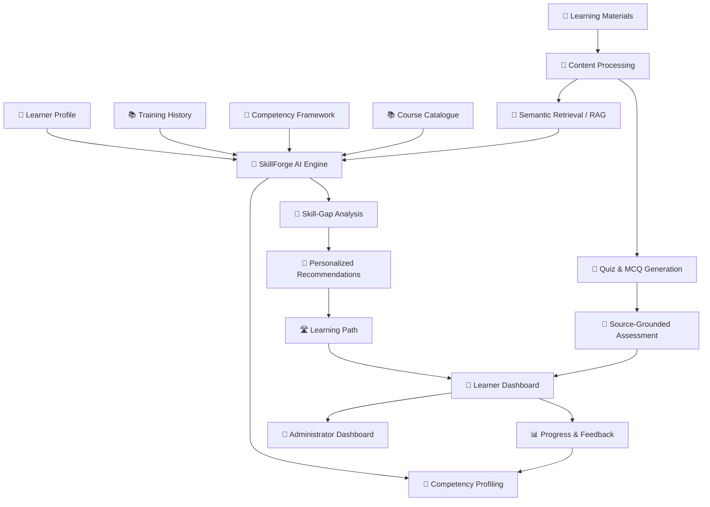

# 🎓 SkillForge AI

### 🤖 AI-Powered Competency & Personalized Learning

> 🚀 **From competency gaps to personalized, evidence-grounded learning.**


---

# 🏆 Smart India Hackathon 2026

| 📌 Detail | Information |
|---|---|
| 🆔 **Problem Statement** | **SIH26101** |
| 🏛️ **Organization** | Ministry of Statistics and Programme Implementation (MoSPI) |
| 🏢 **Department** | Data Informatics & Innovation Division (DIID) |
| 💻 **Category** | Software |
| 🎓 **Theme** | Smart Education |
| 🚀 **Project** | **SkillForge AI** |

---

# 📜 Problem Statement

> **Develop an AI enabled learning platform that identifies competency gaps, recommends personalized training through integration with the iGOT Karmayogi ecosystem, and is capable of generating Quizzes and Multiple choice questions (MCQs) from uploaded learning materials to strengthen capacity building in India's Official Statistical System.**

---

# 🌟 What is SkillForge AI?

**SkillForge AI** is an AI-powered competency and personalized learning platform designed to help learners and organizations:

- 🧩 Identify competency gaps
- 🔎 Analyze skill requirements
- 🎯 Generate personalized learning paths
- 📚 Recommend relevant learning resources
- 📝 Generate quizzes and MCQs from learning materials
- 📌 Provide source-grounded assessment
- 📊 Track learning and assessment progress
- 🔄 Continuously improve competency profiles

The platform follows a simple intelligent learning cycle:

```text
👤 Learner Profile
       ↓
🧩 Competency Mapping
       ↓
🔎 Skill-Gap Analysis
       ↓
🎯 Personalized Learning
       ↓
📝 Quiz / MCQ Assessment
       ↓
📊 Performance & Feedback
       ↓
🔄 Competency Update
       ↓
🚀 Continuous Upskilling
```

---

# 🚨 Problem We Are Solving

Traditional learning and training workflows can involve:

- 🔍 Manual competency assessment
- 📚 Generic training programs
- 🧭 Difficulty finding relevant courses
- 📝 Manual quiz and MCQ creation
- 📊 Fragmented progress tracking
- 🔄 Limited continuous feedback
- 👨‍🏫 High trainer and administrator workload
- 🧩 Weak connection between competency gaps and learning resources

### 💡 Our Approach

Instead of asking:

> 📚 **"Which course should everyone take?"**

SkillForge AI asks:

> 🧠 **"Which competency does this learner need to develop, and what should they learn next?"**

---

# ✨ Key Features

## 👤 1. AI Competency Profiling

SkillForge AI can process:

- 👤 Learner profile
- 🧑‍💼 Role
- 🏢 Department
- 🧠 Existing skills
- 📚 Training history
- 📝 Assessment performance

and create a structured competency profile.

---

## 🔎 2. AI-Based Skill-Gap Analysis

The system compares:

```text
Current Competencies
        +
Required Competencies
        ↓
🔎 Skill-Gap Analysis
```

This helps identify competencies where additional learning may be required.

---

## 🎯 3. Personalized Learning Paths

Recommendations can consider:

- 👤 Learner profile
- 🧩 Competency gaps
- 🏢 Role
- 📚 Learning history
- 📊 Assessment performance
- 🔎 Semantic relevance

The result is a more targeted learning journey.

---

## 📝 4. AI Quiz & MCQ Generation

Learning material can be processed through:

```text
📄 Upload Learning Material
          ↓
🧹 Clean & Process
          ↓
🔎 Extract Topics & Skills
          ↓
🧠 Understand Content
          ↓
📝 Generate Quiz / MCQs
          ↓
✅ Answers
          ↓
💡 Explanations
          ↓
📌 Source Traceability
```

---

## 📌 5. Evidence-Grounded Learning

SkillForge AI can use **Semantic Search + RAG** to retrieve relevant content before generating questions or explanations.

```text
📚 Learning Material
        ↓
✂️ Chunking
        ↓
🧠 Embeddings
        ↓
🔎 Semantic Retrieval
        ↓
📖 Relevant Context
        ↓
🤖 LLM
        ↓
📝 Question + Answer + Explanation
        ↓
📌 Source Reference
```

> ⚠️ RAG and source grounding can reduce unsupported generation, but they do not guarantee zero hallucinations.

---

## 🧠 6. Adaptive Assessment

Assessment results can be used to identify:

- ✅ Strong areas
- ⚠️ Weak areas
- 📈 Progress
- 🎯 Competencies requiring further learning

```text
📚 Learn
   ↓
📝 Practice
   ↓
📊 Assess
   ↓
💡 Feedback
   ↓
🔄 Improve
   ↓
📝 Reassess
```

---

## 📊 7. Learner Dashboard

The learner dashboard can provide:

- 🧩 Competency Profile
- 🔎 Skill Gaps
- 🎯 Recommended Learning
- 📚 Learning Progress
- 📝 Quizzes
- 📊 Assessment Results
- 🚀 Next Learning Recommendations

---

## 🏢 8. Administrator Dashboard

Administrators can view:

- 👥 Learner competency overview
- 🔎 Common skill gaps
- 📚 Training progress
- 📝 Assessment performance
- 📊 Learning analytics
- 🎯 Capacity-building requirements

---

# 🔗 iGOT Karmayogi Integration

SkillForge AI is designed with integration into the **iGOT Karmayogi ecosystem** in mind.

The platform can use authorized course/catalogue information to improve personalized learning recommendations.

### 🔐 Integration Status

> **iGOT Karmayogi integration is API-ready and subject to authorization/access.**

During prototype development, mock or sample catalogue data can be used if live API access is not available.

🌐 [iGOT Karmayogi](https://www.igotkarmayogi.gov.in/)

🏛️ [Capacity Building Commission](https://www.cbc.gov.in/)

🧩 [Karmayogi Competency Model](https://cbc.gov.in/karmayogi-competency-model-kcm)

---

# 🧩 Competency Domains

## 📊 Statistical Competencies

- 📋 Survey Design
- 🎲 Sampling
- 📈 National Accounts
- 💰 Price Statistics
- 👥 Labour Statistics
- 🌾 Agricultural Statistics
- 🏭 Industrial Statistics
- 🌍 SDG Indicators
- 🗂️ Metadata Standards
- ✅ Data Quality Frameworks

## 💻 Technical Competencies

- 🐍 Python
- 📊 R
- 🗄️ SQL
- 📈 Stata
- 📊 SPSS
- 📊 SAS
- 🗺️ GIS
- 📊 Data Visualization
- 🤖 AI / ML
- ☁️ Cloud
- 🔗 APIs
- 🌐 Open Data

## 🏛️ Digital Governance

- 🔐 Cybersecurity
- 🛡️ Data Privacy
- ✍️ Digital Signatures
- ☁️ Government Cloud
- 🌐 Digital Public Infrastructure

## 👥 Behavioural & Managerial

- 👑 Leadership
- 🗣️ Communication
- 📋 Project Management
- ⚖️ Ethics
- 🧠 Decision Making
- 🔄 Change Management

---

# 🏗️ System Architecture



---

# 🔬 AI Intelligence Layer

### 🧠 NLP

Used for:

- 📄 Text extraction
- 🔎 Topic identification
- 🧩 Skill extraction
- 🧠 Competency mapping
- 📚 Content understanding

### 🤖 LLM

Used for:

- 📝 Question generation
- 💡 Explanations
- 🎯 Learning assistance
- 📚 Content understanding
- 🔎 Recommendation reasoning

### 🔎 Semantic Search

Used to find learning resources that are semantically relevant to learner needs.

### 📚 RAG

Retrieval-Augmented Generation can provide relevant source context before generating AI content.

### 🎯 Recommendation Engine

Uses learner and competency information to generate targeted learning recommendations.

---

# 🔄 How SkillForge AI Works

## 🟠 Phase 1: Content & Profile Input

```text
👤 Learner Profile
📚 Training History
📄 Learning Materials
🧩 Competency Framework
        ↓
🧹 Content Processing
        ↓
🔎 Topic / Skill Extraction
        ↓
🧩 Competency Mapping
```

### 📤 Output

📊 Structured competency and learning profile.

---

## 🔵 Phase 2: Competency Intelligence

```text
Current Competencies
        +
Required Competencies
        ↓
🔎 Skill-Gap Analysis
        ↓
🔍 Semantic Matching
        ↓
🎯 Personalized Recommendation
        ↓
🛣️ Learning Path
```

### 📤 Output

🎯 Personalized learning plan and targeted resources.

---

## 🟢 Phase 3: Learning & Improvement

```text
📚 Learn
  ↓
📝 Practice
  ↓
📊 Evaluate
  ↓
💡 Feedback
  ↓
🔄 Update Competency Profile
  ↓
🎯 Recommend Next Learning
```

### 📤 Output

🚀 Continuous competency development.

---

# 🛠️ Technology Stack

| Layer | Technology |
|---|---|
| 🐍 Backend | Python |
| ⚡ API | FastAPI |
| 🧠 NLP | Hugging Face Transformers |
| 🤖 LLM | OpenAI-compatible / Local LLM |
| 🔎 Embeddings | Sentence Transformers |
| 📚 RAG | Retrieval-Augmented Generation |
| 🗄️ Database | PostgreSQL |
| 🔍 Vector Search | FAISS / pgvector |
| ⚛️ Frontend | React |
| 🐳 Deployment | Docker |

### ⚙️ AI Stack

```text
🧠 NLP
   +
🤖 LLM
   +
🔎 Embeddings
   +
📚 RAG
   +
🎯 Recommendation
   +
🧩 Competency Mapping
   +
📝 Automated Assessment
   +
📊 Analytics
```

---

# 📊 Impacts & Benefits

## 🟢 Learning Impact

- 🔎 Better visibility into competency gaps
- 🎯 Targeted learning recommendations
- 📚 Continuous upskilling
- 🧠 Competency-focused development

## 🔵 Operational Impact

- ⏱️ Reduced manual competency-assessment effort
- 📝 Reduced quiz-authoring workload
- 🔍 Faster discovery of relevant resources
- 🏢 Unified learning workflow

## 🟠 Data & Decision Impact

- 📊 Actionable competency insights
- 📈 Learning progress visibility
- 🧠 Evidence-based training decisions
- 🔄 Continuous competency improvement

---

# ⚖️ Traditional Approach vs SkillForge AI

| Feature | 🧑‍🏫 Traditional / Manual | 🤖 SkillForge AI |
|---|---|---|
| 🔎 Competency-gap identification | Manual / Limited | 🟢 AI-assisted |
| 🎯 Role-based recommendations | Often manual | 🟢 Personalized |
| 🛣️ Learning path | Generic / Trainer-driven | 🟢 Gap-aware |
| 📝 Quiz generation | Manual | 🟢 AI-assisted |
| 📌 Source-grounded questions | Separate effort | 🟢 Designed into workflow |
| 📊 Progress tracking | Basic / Fragmented | 🟢 Unified |
| 🏢 Administrator analytics | Limited / Separate | 🟢 Centralized |
| 🧩 Competency alignment | Manual mapping may be required | 🟢 Competency-first |
| 🔄 Continuous feedback | System-dependent | 🟢 Built into learning loop |

---

# 🌟 What Makes SkillForge AI Different?

### 🧩 Competency-First

We focus on:

> **What competency needs improvement?**

rather than simply:

> **Which course should be recommended?**

### 🎯 Personalized

Learning recommendations can consider:

- 👤 Profile
- 🏢 Role
- 🧩 Competency gaps
- 📚 Learning history
- 📊 Assessment performance

### 📝 Assessment Automation

Trainers can generate quizzes and MCQs from uploaded learning content.

### 📌 Evidence-Grounded

Relevant source material can be retrieved before generating questions and explanations.

### 🔄 Continuous Learning Loop

```text
Identify
   ↓
Learn
   ↓
Practice
   ↓
Assess
   ↓
Feedback
   ↓
Improve
   ↓
Repeat 🔄
```

---

# ⚠️ Technical Challenges & Mitigation

| 🚨 Challenge | 🛡️ Mitigation |
|---|---|
| Diverse learning materials | 🧹 Parsing + preprocessing + chunking |
| Competency extraction | 🧩 Mapping + validation |
| Low-quality AI questions | 📝 Structured generation + validation |
| Unsupported AI output | 📚 RAG + source grounding |
| Recommendation quality | 🎯 Semantic matching + feedback |
| iGOT API access | 🔗 API-ready architecture |
| User trust | 💡 Explainable recommendations |

---

# 👥 Business & User Challenges

### 🚨 Risks

- 🤔 Users may hesitate to trust AI recommendations
- 📱 Different levels of digital literacy
- 📝 Concerns about generated question quality
- 🔄 Adoption challenges
- 🔐 Privacy concerns

### 🛡️ Mitigation

- 💡 Explain recommendations
- 📌 Show source context where possible
- 🖥️ Build an intuitive interface
- 👨‍🏫 Human validation for high-stakes assessment
- 📊 Collect user feedback
- 🚀 Begin with controlled pilot deployment

---

# 🔐 Privacy & Security

SkillForge AI follows responsible design principles:

- 🔒 Minimize personal-data collection
- 👤 Role-based access control
- 🔑 Secure authentication
- 🛡️ Authorization
- 🌐 Secure API communication
- 🗄️ Secure database configuration
- 📌 Appropriate audit logging
- 🔐 Protect sensitive learner information

### ❌ Never commit

```text
❌ API Keys
❌ Passwords
❌ Database Credentials
❌ Private Tokens
❌ Production Secrets
❌ Personal Learner Data
```

---

# 🚀 Implementation Roadmap

## 🟡 Phase 1 — MVP

- 👤 Learner profile
- 📄 Learning material upload
- 🧩 Competency profiling
- 🔎 Skill-gap analysis
- 📝 Quiz/MCQ generation

## 🔵 Phase 2 — Intelligent Prototype

- 🔎 Semantic search
- 📚 RAG
- 🎯 Personalized recommendations
- 📊 Learner dashboard
- 🏢 Administrator dashboard
- 📈 Progress tracking

## 🟢 Phase 3 — Integration

- 🔗 Authorized iGOT integration
- 🧩 Advanced competency mapping
- 🔄 Adaptive learning
- 📊 Advanced analytics

## 🟣 Phase 4 — Future

- 🌐 Multilingual learning
- 🎙️ Voice-enabled learning
- 🖼️ OCR
- 🎥 Video transcript processing
- 📱 Mobile application
- 🧠 Advanced adaptive learning
- 🏢 Organization-wide competency analytics

---

# 📂 Repository Structure

```text
SkillForge-AI/
│
├── 📁 backend/
│   ├── 📁 app/
│   ├── 📁 api/
│   ├── 📁 models/
│   ├── 📁 services/
│   ├── 📁 rag/
│   ├── 📁 recommendation/
│   ├── 📁 assessment/
│   └── 🐍 main.py
│
├── 📁 frontend/
│   ├── 📁 src/
│   ├── 📁 components/
│   ├── 📁 pages/
│   └── 📁 services/
│
├── 📁 data/
│   └── 📁 sample/
│
├── 📁 docs/
│   ├── 📁 architecture/
│   ├── 📁 research/
│   └── 📁 screenshots/
│
├── 📁 tests/
│
├── 📁 docker/
│
├── 📄 requirements.txt
├── 📄 README.md
└── 📄 LICENSE
```

> 📌 Update this structure to match the actual implementation.

---

# 🔌 Proposed API

> ⚠️ These are proposed endpoints unless they already exist in the implementation.

| Method | Endpoint | Purpose |
|---|---|---|
| `POST` | `/api/profile` | 👤 Learner profile |
| `POST` | `/api/materials/upload` | 📄 Upload material |
| `POST` | `/api/competency/analyze` | 🧩 Competency analysis |
| `POST` | `/api/skills/gap-analysis` | 🔎 Skill-gap analysis |
| `POST` | `/api/recommendations` | 🎯 Recommendations |
| `POST` | `/api/quiz/generate` | 📝 Generate quiz/MCQs |
| `GET` | `/api/progress` | 📊 Learner progress |
| `GET` | `/api/dashboard` | 📈 Dashboard data |

---

# 💻 Installation

## 1️⃣ Clone Repository

```bash
git clone <YOUR_GITHUB_REPOSITORY_URL>
cd SkillForge-AI
```

## 2️⃣ Create Virtual Environment

### 🪟 Windows

```bash
python -m venv .venv
.venv\Scripts\activate
```

### 🐧 Linux / macOS

```bash
python -m venv .venv
source .venv/bin/activate
```

## 3️⃣ Install Dependencies

```bash
pip install -r requirements.txt
```

## 4️⃣ Configure Environment

Create a `.env` file:

```env
OPENAI_API_KEY=
DATABASE_URL=
MODEL_NAME=
VECTOR_DB_URL=
```

🔐 Never upload your `.env` file to GitHub.

## 5️⃣ Run Backend

```bash
uvicorn app.main:app --reload
```

## 6️⃣ Run Frontend

```bash
cd frontend
npm install
npm run dev
```

> ⚠️ Update commands according to the actual project implementation.

---

# 🐳 Docker Deployment

Conceptual deployment:

```text
                 🌐 User
                   │
                   ▼
            ⚛️ React Frontend
                   │
                   ▼
            ⚡ FastAPI Backend
              │          │
              ▼          ▼
       🗄️ PostgreSQL   🔎 Vector Store
              │          │
              └────┬─────┘
                   ▼
              🧠 AI Engine
              │     │     │
              ▼     ▼     ▼
             NLP   LLM  RAG
```

---

# 🧪 Testing

SkillForge AI should be evaluated at multiple levels.

### 🧠 AI Evaluation

- 🧩 Competency mapping quality
- 🔎 Skill-gap identification
- 🎯 Recommendation relevance
- 📝 Question quality
- ✅ Answer correctness
- 📌 Source grounding

### 💻 Software Testing

- 🧪 Unit tests
- 🔗 Integration tests
- 🌐 API tests
- 🖥️ Frontend tests
- 🗄️ Database tests

### 👥 User Evaluation

- 🖥️ Usability
- 🎯 Recommendation usefulness
- 📝 Question relevance
- 📊 Dashboard clarity
- 💬 User feedback

> 📌 Numerical accuracy or performance results should only be published after actual testing.

---

# 📸 Screenshots

Add screenshots as the project develops.

```text
🖥️ Learner Dashboard
        ↓
🧩 Competency Profile
        ↓
🔎 Skill Gaps
        ↓
🎯 Recommendations
        ↓
📝 Quiz Generator
        ↓
📊 Progress
```

---

# 📚 Research Foundation

SkillForge AI is based on several technology and learning concepts:

- 🏛️ iGOT Karmayogi and competency-based capacity building
- 🧩 Karmayogi Competency Model
- 🧠 Natural Language Processing
- 🤖 Large Language Models
- 📝 Automated Question Generation
- 🔎 Semantic Search
- 📚 Retrieval-Augmented Generation
- 🎯 Recommendation Systems
- 🔄 Adaptive Learning
- 📊 Learning Analytics

### 🔗 References

- 🏆 [Smart India Hackathon](https://www.sih.gov.in/)
- 🏛️ [iGOT Karmayogi](https://www.igotkarmayogi.gov.in/)
- 🧩 [Capacity Building Commission](https://www.cbc.gov.in/)
- 📚 [Karmayogi Competency Model](https://cbc.gov.in/karmayogi-competency-model-kcm)

---

# 👥 Team SkillForge AI

| 👤 Member | Role |
|---|---|
| 👨‍💻 **RITESH PAITHANKAR** | Team Member |
| 👨‍💻 **SUMIT RATHOD** | Team Member |
| 👨‍💻 **NIRAJ KHARAT** | Team Member |
| 👨‍💻 **GANESH TAUR** | Team Member |
| 👩‍💻 **RUTUJA PAWAR** | Team Member |

🆔 **Team ID:** To be updated

🏫 **Institute:** To be updated

---

# 🤝 Contribution

```text
🍴 Fork
 ↓
🌿 Create Branch
 ↓
💻 Make Changes
 ↓
🧪 Test
 ↓
📤 Pull Request
 ↓
👀 Review
 ↓
✅ Merge
```

Contributions, suggestions and improvements are welcome.

---

# 🐞 Issues & Feedback

Found a bug? 🐞

Have an idea? 💡

Want a new feature? 🚀

Open a GitHub Issue with:

```text
📌 Title
📝 Description
🔁 Steps to Reproduce
💻 Environment
📸 Screenshots / Logs
🎯 Expected Behaviour
```

---

# ⚠️ Responsible AI

SkillForge AI is designed as an **AI-assisted learning and competency-support platform**.

It does not replace:

- 👨‍🏫 Trainers
- 🏢 Administrators
- 🧑‍💼 Domain experts
- 🏛️ Official decision-makers

AI-generated recommendations and assessment content should be appropriately reviewed, especially for high-stakes training.

---

# 📜 Disclaimer

> 🇮🇳 **SkillForge AI is a prototype developed for Smart India Hackathon 2026.**

The platform is intended to assist with:

- 🧩 Competency analysis
- 🎯 Learning recommendations
- 📝 Assessment generation
- 📊 Learning analytics
- 🔄 Continuous upskilling

It should not be interpreted as a replacement for official training policies, trainers, administrators or human decision-making.

---

# 🌱 Our Vision

> 🧠 **Identify the Gap.**  
> 🎯 **Find the Right Learning.**  
> 📝 **Practice with Purpose.**  
> 📊 **Measure Progress.**  
> 🚀 **Build Better Competencies.**

---

# ⭐ SkillForge AI

### 🎓 Learn Smarter • 🧩 Build Competencies • 🚀 Strengthen Capacity

🇮🇳 **Built for Smart India Hackathon 2026**

---

<p align="center">

## 🤖 SkillForge AI

### AI-Powered Competency & Personalized Learning

🧠 NLP & LLM  
🔎 Semantic Search  
🧩 Competency Mapping  
🎯 Personalized Learning  
📝 AI Assessment  
📊 Learning Analytics  

### 🚀 From competency gaps to personalized, evidence-grounded learning.

</p>
